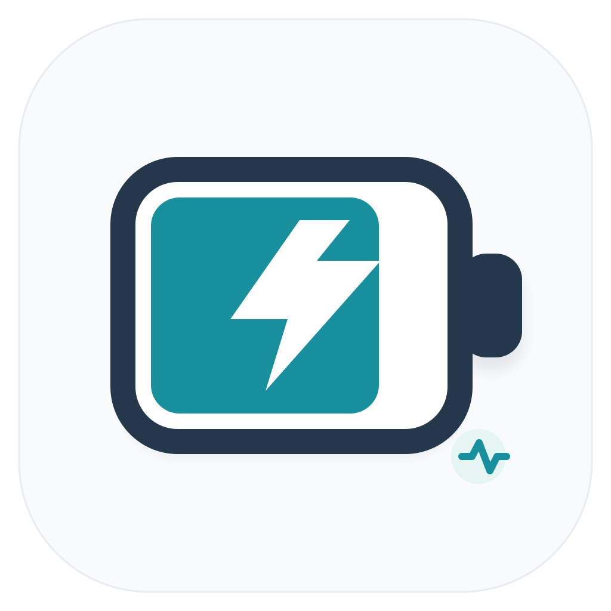

# 🔋 Battery Logger for macOS

  

  <b>The ultimate macOS battery telemetry, health preservation & AI diagnostic companion.</b> 
  Hardware SMC charge limiting (80% / 85%), pure hardware power bypass, real-time wattage monitor, native frosted glass dashboard, Desktop Widgets, ecosystem peripheral battery tracking, and zero-overhead performance.

  
  
  
  

---

## 📥 下載最新版 / Download Latest Release

* 🚀 **[點此直接下載 Battery_Logger_macOS_v2.0.1.dmg (Direct Download)](https://github.com/mic1491/Battery-Logger-macOS/raw/main/Battery_Logger_macOS_v2.0.1.dmg)**
* 📦 **備用連結：[前往 Releases 頁面下載最新版](https://github.com/mic1491/Battery-Logger-macOS/releases/latest)**

> 💡 **v2.0.1 新增特色**：內建「極致深度睡眠模式 (Extreme Deep Sleep)」，智慧診斷並阻斷休眠期間 DarkWake 網路封包偷電，使闔蓋整夜掉電從 10% 暴跌至 1~2%！
>
> 💡 **安裝說明**：下載完成後雙擊開啟 `.dmg` 檔案，將 **Battery Logger.app** 拖曳至 **Applications (應用程式)** 資料夾即可使用。若首次開啟遇到 macOS 守門員安全性阻擋，可直接雙擊 `.dmg` 內附的 `一鍵解除隔離 (Fix Gatekeeper).command` 執行。

---

## ✨ 核心特色功能 (Key Features)

### 1. 🛡️ 真實硬體級旁路供電 (Hardware SMC Bypass Limiting)
- 直接讀寫 Apple SMC 硬體暫存器，自訂充電上限（例如 80% / 85%）。
- 達到上限後物理切斷充電電流（`0 mA`），完全由外接電源直供（Bypass），杜絕鋰電芯持續高壓浮充與微循環磨損。

### 2. ⚡️ 即時功率與電化學遙測 (Real-Time Telemetry)
- 毫秒級即時監控充電功率（`+30.2W`）與系統放電功率（`-7.4W`）。
- 辨識充電器與 USB-C 線材品質，偵測等效線阻與壓降。

### 3. 🎧 跨裝置藍牙周邊電量監控 (Ecosystem Battery Monitor)
- 一覽 Magic Mouse、Magic Keyboard、AirPods 等已配對配件的剩餘電量與充電狀態。

### 4. 🎯 AppleCare+ 出保雷達預測 (AppleCare+ Claim Radar)
- 擬合電芯真實衰退斜率，精準推算跌破 79.5%（原廠保固免費換新門檻）的預計日期與建議對策。

### 5. 🪓 AI 異常吃電兇手獵殺 (EWMA Power Anomaly Hunter)
- 動態計算功率基準線，偵測異常放電突波。
- 精準抓出背後偷電的失控程式，並提供安全彈窗確認與優雅終止。

### 6. 🔬 卡爾曼平滑健康度與阿瑞尼斯老化壓力評分
- 濾除溫度波動造成的假性 SOH 抖動，還原真實容量曲線。
- 綜合高溫、滿電停留時長，計算 0~100 分的「電池老化壓力指數」。

### 7. 🌐 多國語言支援 (Multi-Language)
- 內建繁體中文（繁體中文）、英文（English）、日文（日本語），支援隨系統切換或手動設定。

### 8. 📱 桌面小工具與靈動精靈 (Widgets & Floating Buddy)
- 支援 macOS 14+ 桌面與通知中心小組件（Small / Medium / Large 24小時放電圖表）。
- 懸浮桌寵（鋼鐵人反應爐、美隊之盾、賽博微型核心、復古像素怪獸）。

---

## 🚀 安裝指引 (Installation Guide)

1. 下載並打開 **`Battery_Logger_macOS_v2.0.0.dmg`**。
2. 將 **`Battery Logger.app`** 拖移至 **`Applications`**（應用程式）資料夾。
3. **若系統提示「已損毀」或「無法打開」**：
   - 雙擊執行 DMG 映像檔內的 **「一鍵解除 Gatekeeper 隔離」** 工具即可一秒解鎖！

---

## 📄 License
Copyright © 2026 Matt. All Rights Reserved.  
Private & Proprietary Software.
